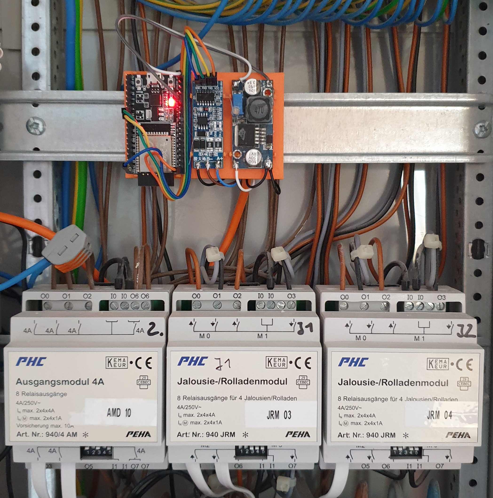

# ESPHome-PHC-Controller

This project implements a PHC Controller which integrates into [Home Assistant](https://home-assistant.io) through [ESPHome](https://esphome.io). This could replace a existing dumb controller (STM - Steuermodul), thus smartifying a existing Phea PHC installation.

# Demo installation

Smart PHC controller with PHC-Modules. A close up of the board containing the ESP32 with the RS-485 converter and a step-down module can be found [here](esp_board.jpg).

# Requirements

This project has been developed and tested on a ESP32. A ESP8266 is probably going to work just fine.

The PHC-Bus is RS-485 based. In order communicate on the bus a RS-485 TTL Adapter is required. Currently only a Chip with automatic flow control has been tested.
Connect the A/B wires to the PHC-bus. This can easily be done using the screw-terminal on the power-supply ([see](power_supply.jpg)).
Finally connect the RS-485 adapter to your ESP and you are good to go.

With the help of a step-down module/voltage converter the 24V supplied by the PHC-power-supply can be used to power the ESP.

Make sure to remove any 
existing controllers (STM - Steuermodul) from the bus, as they will interfere. 

# Configuration variables

A example configuration can be found [here](example.yaml)

## PHC Controller
- **id**(**Required**, string): Controller ID which will be used for entity configuration.
- **uart_id**(**Required**, string): ID of the UART-Component connected to the PHC-Bus

## AMD(Output module/Ausgangsmodul) as switch
- **phc_controller_id**(**Required**, string): The PHC-Controller to which this entity belongs
- **address**(**Required**, int): Module DIP-Switch address
- **channel**(**Required**, int): Output channel on the Module
- All other options from [Switch](https://esphome.io/components/switch/index.html#config-switch)

## AMD(Output module/Ausgangsmodul) as light
- **phc_controller_id**(**Required**, string): The PHC-Controller to which this entity belongs
- **address**(**Required**, int): Module DIP-Switch address
- **channel**(**Required**, int): Output channel on the Module
- All other options from [Light](https://esphome.io/components/light/index.html#config)

## EMD(Input module/Eingangsmodul) Output as light
- **phc_controller_id**(**Required**, string): The PHC-Controller to which this entity belongs
- **address**(**Required**, int): Module DIP-Switch address
- **channel**(**Required**, int): Output channel on the Module
- All other options from [Light](https://esphome.io/components/light/index.html#config)

## EMD as binary sensor
- **phc_controller_id**(**Required**, string): The PHC-Controller to which this entity belongs
- **address**(**Required**, int): Module DIP-Switch address
- **channel**(**Required**, int): Output channel on the Module
- All other options from [Binary Sensor](https://esphome.io/components/binary_sensor/index.html#config)

## JRM(Blinds-Module/ Jalousie-Rolladen Modul)
- **phc_controller_id**(**Required**, string): The PHC-Controller to which this entity belongs
- **address**(**Required**, int): Module DIP-Switch address
- **channel**(**Required**, int): Output channel on the Module
- **max_open_time**(Optional, Time): Determines for how long the Output will be enabled while opening. This value should guarantee the cover reaches it's open state. Defaults to `30s`.
- **max_close_time**(Optional, Time): Determines for how long the Output will be enabled while closing. This value should guarantee the cover reaches it's closed state. Defaults to `30s`.
- **assume_position**(Optional): Assume the covers position based on measured open/close times
    - **open_time**(**Required**, Time): The time it takes to open the cover completely from it's closed state. Must be smaller than `max_open_time`.
    - **close_time**(**Required**, Time): The time it takes to close the cover completely from it's opened state. Must be smaller than `max_close_time`.

- All other options from [Cover](https://esphome.io/components/cover/index.html#config)

# Related work
Without previous reverse engineering work done by others this would have been a lot more time consuming.

- [PHC-Protokoll](https://www.phc-forum.de/media/kunena/attachments/253/PHC-Protokoll.pdf)
- [Openhab PHC](https://github.com/openhab/openhab-addons/blob/da59cdd255a66275dd7ae11dd294fedca4942d30/bundles/org.openhab.binding.phc/src/main/java/org/openhab/binding/phc/internal/handler/PHCBridgeHandler.java)

# Throubleshooting
- The UART debug function can be used to analyze communication on the bus.
- Kown Memory Issues:
    - ESP8266 out-of-memory exception
    - Guru Meditation Error: exception caused by `LOOP_STACK_SIZE` exceeded
        - [solution](https://community.platformio.org/t/esp32-stack-configuration-reloaded/20994/2)